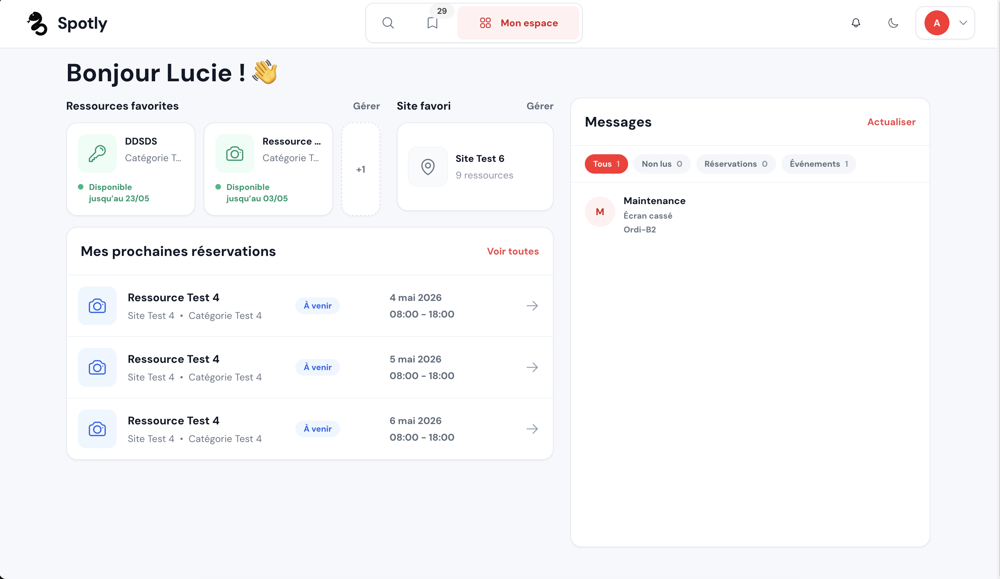
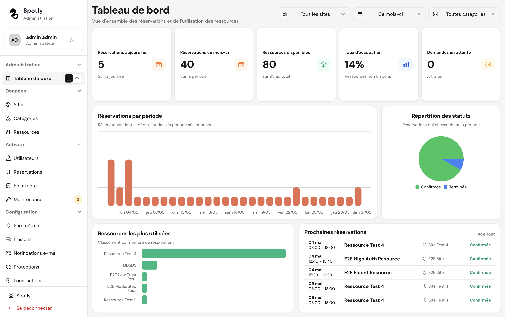
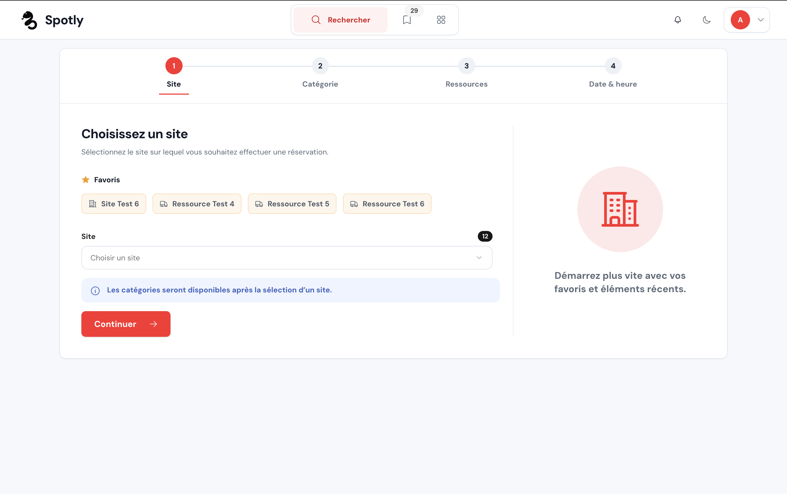

# Spotly

Spotly est une application web de réservation et de suivi de ressources partagées: matériel, salles, véhicules, équipements métiers ou ressources internes.

La version actuelle est orientée production: espace utilisateur, recherche de disponibilités, réservations récurrentes, tableau de bord admin, maintenance, notifications, conversations, emails configurables, LDAP/SSO/Kerberos et contrôle de récupération par niveau de confiance.

## Aperçu

Place les captures dans `docs/screenshots/` avec ces noms exacts:

- `mon-espace.png`
- `tableau-de-bord.png`
- `rechercher.png`







## Fonctionnalités

- Réservation de ressources avec recherche par site, catégorie, ressource et période.
- Gestion des favoris utilisateur pour accéder rapidement aux sites et ressources clés.
- Suivi des réservations: en attente, confirmées, en cours, retardées, terminées ou refusées.
- Récupération et restitution selon le niveau de contrôle: fluide, bouton, code ou appareil autorisé.
- Prise en charge anticipée configurable avec `maxEarlyPickupMinutes`.
- Réservations récurrentes et gestion de groupes de réservations.
- Conversations liées aux réservations et aux événements de maintenance.
- Notifications internes pour demandes à traiter, retards, conversations non lues et incidents.
- Emails configurables par template depuis l’administration.
- Tableau de bord admin avec métriques, graphiques, filtres et vues activité/maintenance.
- Maintenance des ressources avec incidents, sévérité, indisponibilité automatique et discussion dédiée.
- Administration des sites, catégories, ressources, utilisateurs, LDAP, SSO, SMTP et paramètres de réservation.

## Stack

- Next.js 15 avec `app/` pour l’interface et `pages/api/` pour les API.
- React 18, TanStack Query, React Hook Form.
- Prisma avec MySQL.
- NextAuth v4 avec authentification locale, LDAP et Kerberos/SSO.
- Radix/shadcn, Tailwind CSS, Recharts et Lucide.
- Jest pour les tests unitaires, Playwright pour l’e2e.

## Installation Locale

```bash
npm install
cp .env.local.template .env.local
npx prisma db push
npm run seed
npm run dev
```

L’application démarre sur `http://localhost:3001`.

Pour lancer les services locaux Docker:

```bash
docker compose up -d
```

Voir `docs/docker.md` pour les valeurs MySQL, LDAP, Keycloak et SMTP local.

## Commandes Utiles

```bash
npm run dev          # développement sur le port 3001
npm test             # tests unitaires
npm run lint         # lint Next.js
npm run build        # build production
npm run check        # validate-env, tests, build
npm run e2e          # tests Playwright
```

## Configuration

Variables strictes à fournir en production:

- `DATABASE_URL`
- `AUTH_SECRET`
- `LDAP_ENCRYPTION_KEY`
- `NEXTAUTH_URL`
- `NEXT_PUBLIC_API_ENDPOINT`

Variables de seed production:

- `SEED_ADMIN_EMAIL`
- `SEED_ADMIN_USERNAME`
- `SEED_ADMIN_PASSWORD`

`SEED_ADMIN_PASSWORD` doit contenir au moins 12 caractères.

## Production

Avant déploiement:

```bash
npm run check
npx prisma migrate deploy
npm run seed:prod
```

Notes importantes:

- La base supportée par le schéma Prisma est MySQL.
- La cron applicative est lancee par le cron systeme via `npm run "run cron"` et `npm run "run cron:daily"`.
- Vercel ne lance pas de processus permanent; utiliser une cron dédiée ou des routes cron protegees.
- Ne change pas `LDAP_ENCRYPTION_KEY` après avoir enregistré LDAP/SMTP/SSO sans prévoir de réenregistrement.

## Documentation

- `CHANGLOG.md`: résumé fonctionnel des changements 2.0.
- `docs/commands.md`: commandes projet.
- `docs/production-full.md`: notes de mise en production.
- `docs/docker.md`: valeurs Docker locales.
- `docs/mail.md`: audit des emails.
- `docs/notifications.md`: audit des notifications.
- `docs/refactor-notes.md`: notes techniques futures.
- `docs/update-version.md`: procédure de version.

## Licence

GNU GPL v3. Voir `LICENSE.md`.

## Auteur

Développé et maintenu par Louis GURITA.

- GitHub: https://github.com/lowouis
- LinkedIn: https://www.linkedin.com/in/louisgurita/
